# Taskmaster
# Lab26
##  For today's lab ,I  started to build an Android app that will be a main focus of the second half of the course: TaskMaster. While I started small today, over time this will grow to be a fully-featured application.
 

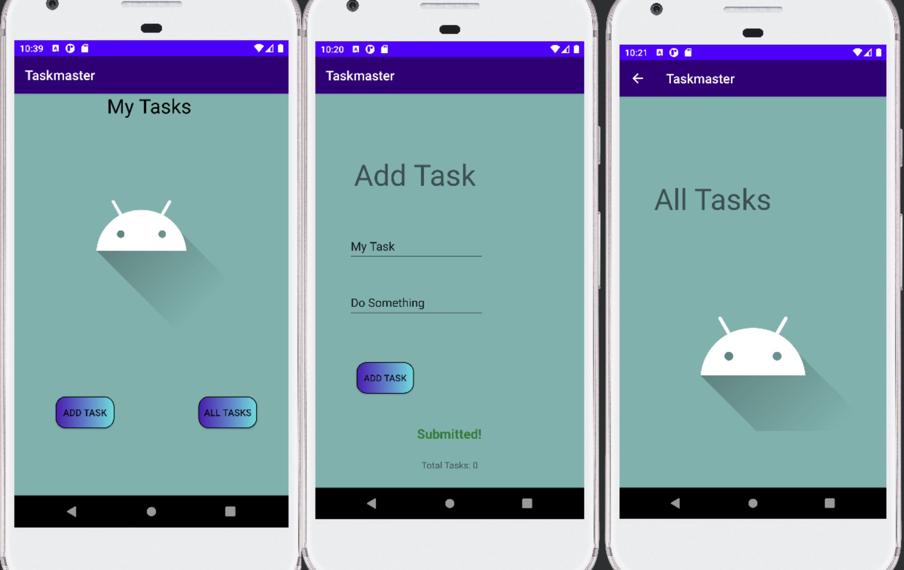

-----------

# Lab27
##  For today's lab , I updated the home page and added Settings  and Task Detail Page .
 

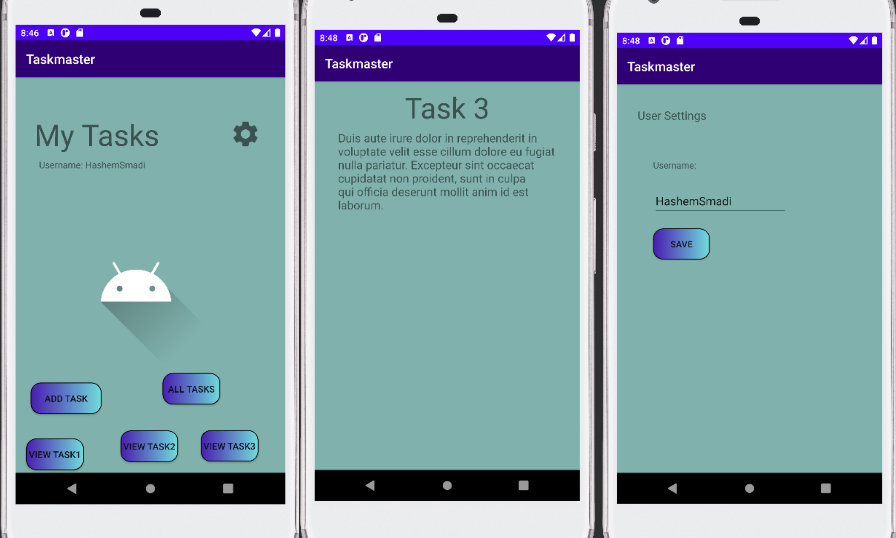

-----------
# Lab28
##  For today's lab ..
*  I updated the home page to use a RecyclerView for displaying Task data. This has hardcoded Task data for now. 
* I created a Task class. A Task should have a title, a body, and a state. The state should be one of “new”, “assigned”, “in progress”, or “complete”.

 

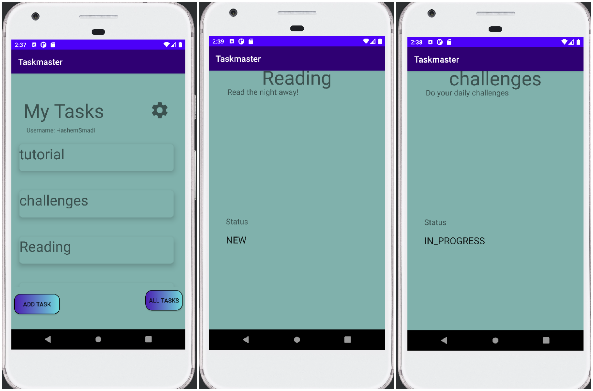

-----------
# Lab29
##  For today's lab ..
*  I updated the add Task page  to add task to room database .
* I Updated a Task class , to represent tabel in databse
* I fetched the data from the database to the home's RecyclerView
* Finally , there is a bottun to clean al tasks 

 

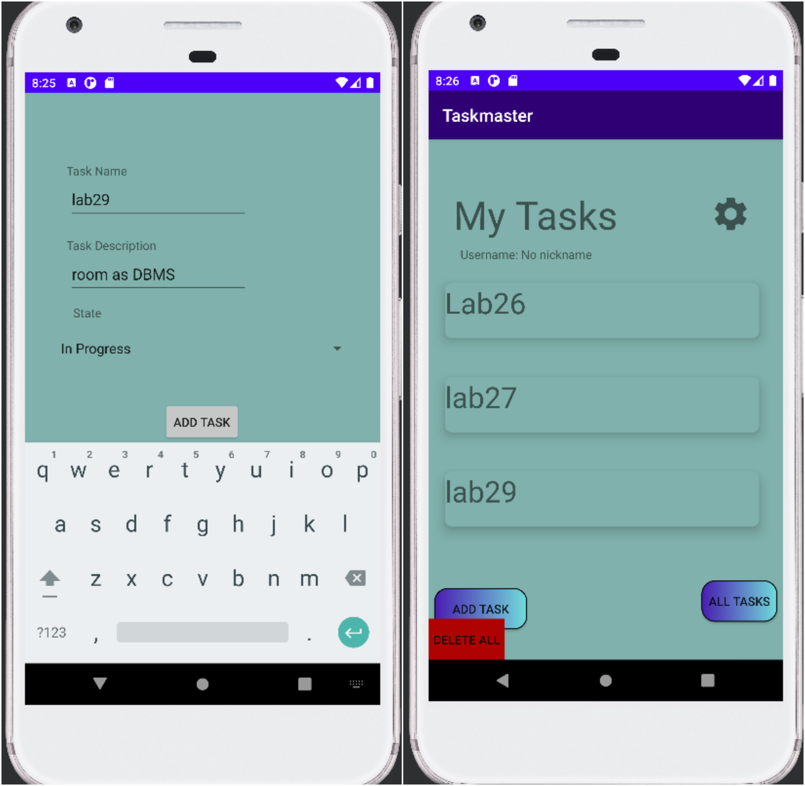

-----------
# Lab31
##  For today's lab ..
* Ensured espreeso tests are functional.

* Refactored Main Activity

* Added styling to UI

* Updated Homepage

 

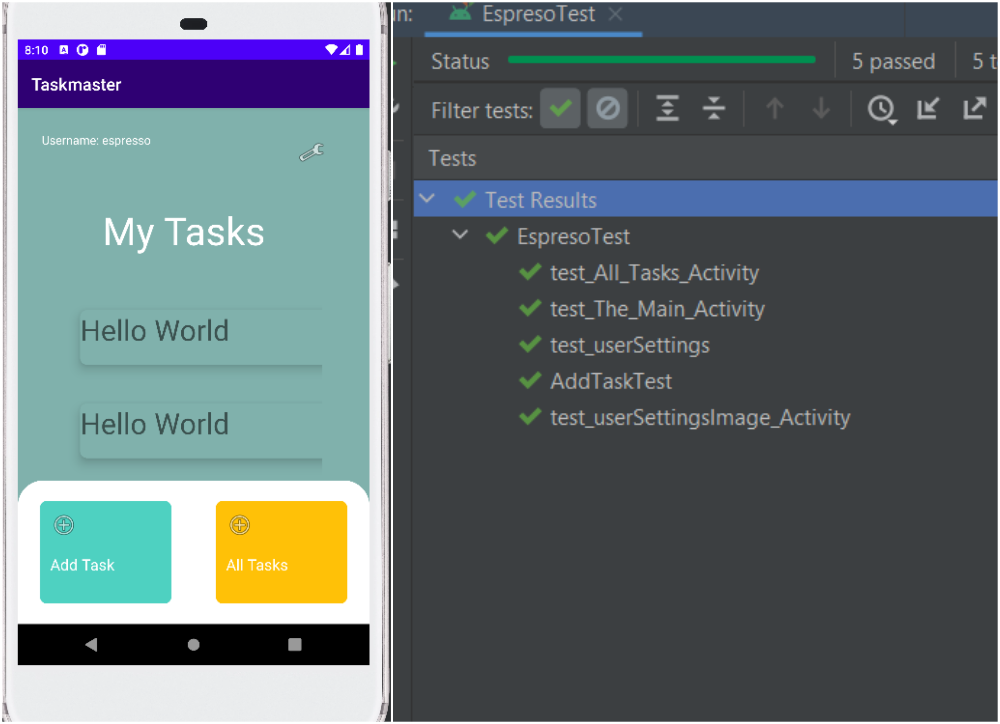

-----------
# Lab32
##  For today's lab ..
* Updated all references to the Task data to instead use AWS Amplify to access data in DynamoDB instead of in Room.
* Refactored Main Activity
* Modified Add Task form to save the data entered in as a Task to DynamoDB.
* Updated Homepage to add FloatingActionButton

 

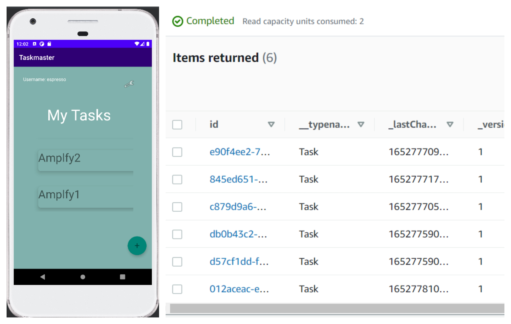

-----------
# Lab33
##  For today's lab ..
* Updated tasks to be owned by teams.
* Three default teams have been made; elves, robots, and humans.
* Spinner used to select a team when creating a task was added.
* Added ability to allow users to choose a team, and filter the tasks on the homepage corresponding to the chosen team.

 

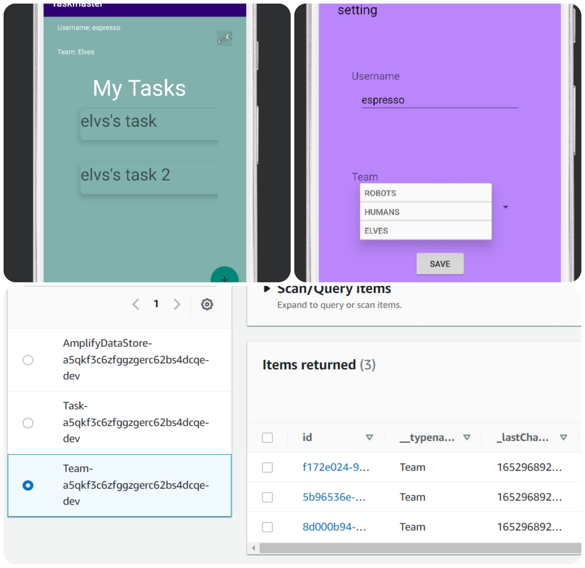

-----------
# Lab34
##  For today's lab ..
* I went go through the process of publishing to the Google Play Store.
* I Built a signed AAB for your application. Included that AAB in my GitHub repo (amplify folder).

-----------
# Lab36
##  For today's lab ..
* Cognito has been added to the Amplify setup. A user login and signup flow has been integrated into th app. Once the user has succesfully logged in, their username is displayed at the top of the homepage.
* Users can logout of the application.

 

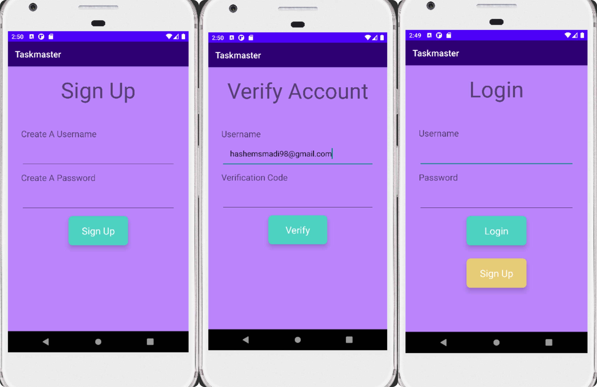

-----------
# Lab37
##  For today's lab ..
* Users can optionally select a file to attach to a task. If a user attaches a file to a task, the file is uploaded to S3, and associated with that task.
* Users can now view the image associated with that Task.

 

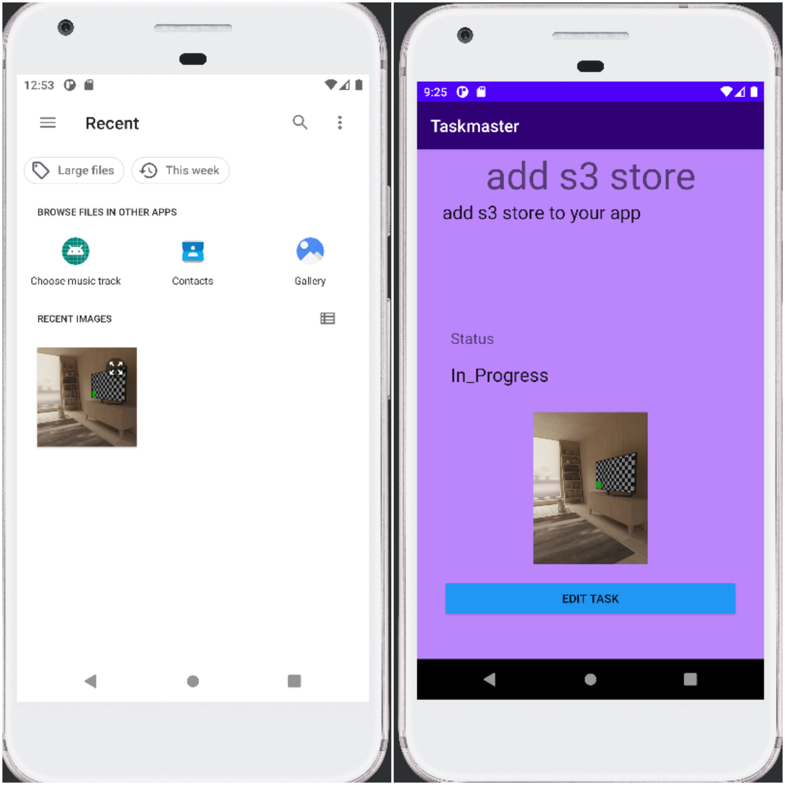

-----------
# Lab38
##  For today's lab ..
* An intent filter was added to the application such that a user can hit the “share” button on an image in another application, choose TaskMaster as the app to share that image with, and be taken directly to the Add a Task activity with that image pre-selected.

 

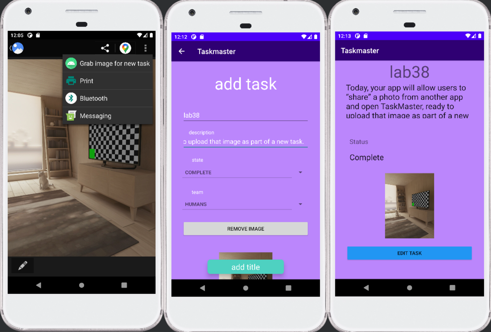

-----------
# Lab41
##  For today's lab ..
* Added Analytics
   *Events are now being tracked using Amazon Pinpoint. Everytime a user enters the Home Activity, it is recorded.
* On task body thers on long click lisenrt showing a dialog box
   * Added ability to hear Task description spoken aloud on View Task page.
   * Added ability to view a translated Task description to Spanish on View Task page.

 

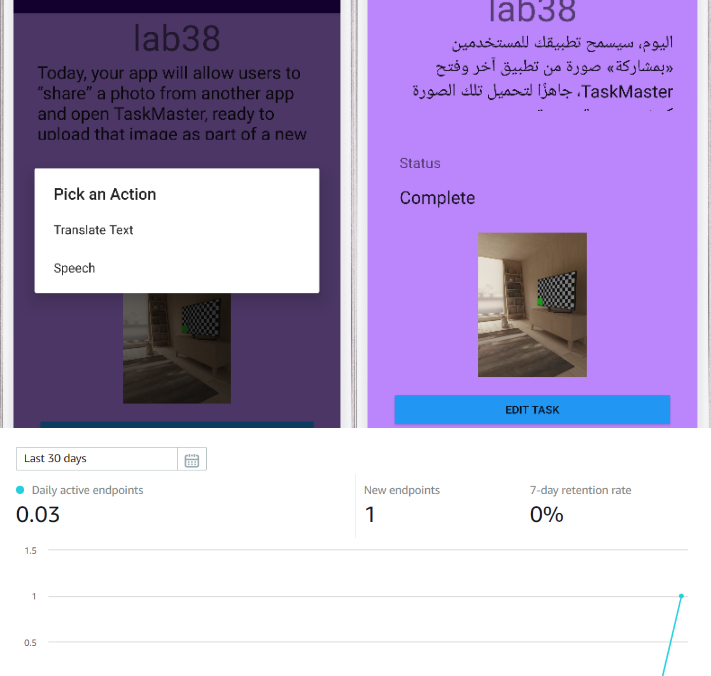

-----------
# Lab42
##  For today's lab ..
* Google ads (AdMob) has been incorporated into activity.
* A banner ad is now displayed at bottom of main activity.
* An interstitial ad can be viewed upon clicking Interstitial button.
* An rewarded ad can be viewed after clicking Rewarded button.

 

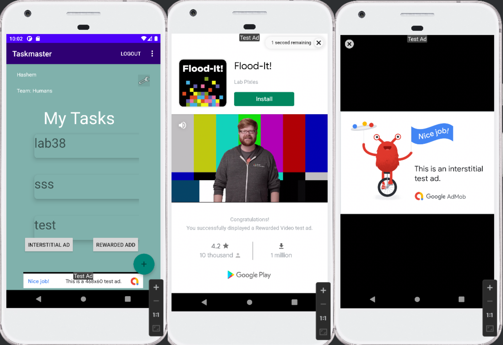

